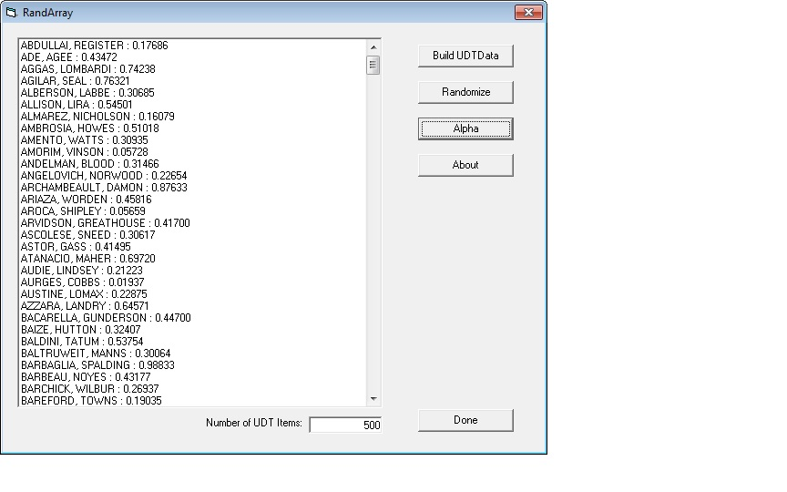



## RandArray

### Description

This code demonstrates how to efficiently randomize an array of user defined type (UDT) items. Basically, you include a  "randValue" property in definition of the UDT, and any time you want to randomize the order,

set this value to rnd() for each  element, and then sort on that property. Pretty useful for a lot of applications. For example,  I originally wrote this to randomly and repeatedly select 5-10 items from an array of thousands of members.

If you like this, please vote. If you don't like it, don't vote. I hope somebody finds something useful

in this.

To use:

1 - Click on the "Build UDT Data" button and enter the number of items you wish to create. The listbox

on the main form will be populated with the UDT items order alphabetically by last name.

2 - To Randomize the items, click on the "Randomize" button. You can do this over and over.

3 - If you want to re-order the UDT items alphabetically, click on the "Alpha" button.
 
### More Info
 

             |
---                |---
**Submitted On**   |2012-05-14 16:10:26
**By**             |[bikeguy](https://github.com/Planet-Source-Code/PSCIndex/blob/master/ByAuthor/bikeguy.md)
**Level**          |Intermediate
**User Rating**    |5.0 (15 globes from 3 users)
**Compatibility**  |VB 6\.0
**Category**       |[Data Structures](https://github.com/Planet-Source-Code/PSCIndex/blob/master/ByCategory/data-structures__1-33.md)
**World**          |[Visual Basic](https://github.com/Planet-Source-Code/PSCIndex/blob/master/ByWorld/visual-basic.md)
**Archive File**   |[RandArray2223935142012\.zip](https://github.com/Planet-Source-Code/bikeguy-randarray__1-74360/archive/master.zip)

